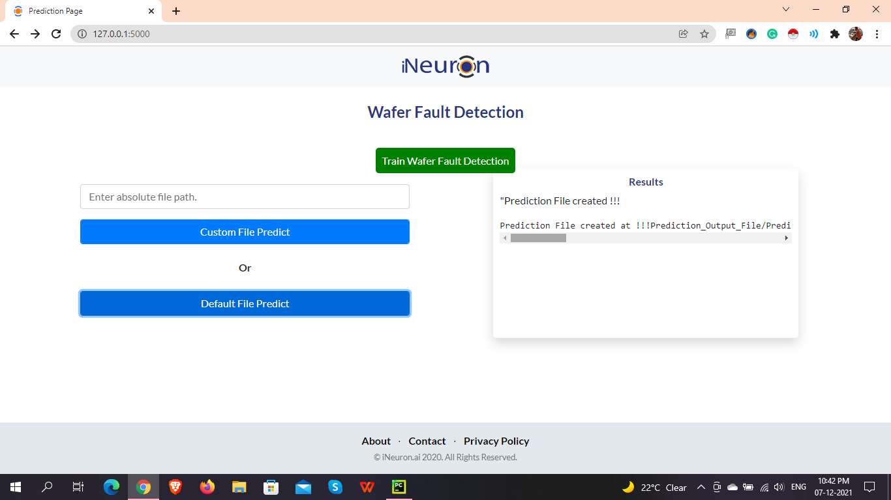

# Wafer Fault Detection

## Table Content
- Introduction
- Approach
- User Interface
- Deployment Link
- Installation
- Technology Used
- Document

## Introduction
To build classification methodology to predict the quality of 
wafer sensor based on the given training data. It contains 592
column in which 590 column contain the sensor data and remaining
column contain wafer name and quality of wafer in category. The
good wafer denoted by -1 & bad wafer denoted by +1.

## Approach


## User Interface

> Home Page


> Training / Prediction Page



## Deployment Link


## Installation
The Code is written in Python 3.7.11. If you don't have Python 
installed you can find it [your link here](https://www.python.org/downloads/). 
If you are using a lower version of Python you can upgrade using the pip package,
ensuring you have the latest version of pip. To install the required packages 
and libraries, run this command in the project directory after 
[cloning](https://docs.github.com/en/github/creating-cloning-and-archiving-repositories/cloning-a-repository) the repository.

### To Create Conda Environment

```commandline
conda create "Your Env name" python==3.7
```

### To Install Requirements.txt File

```commandline
pip install -r requirements.txt
```

## Technology Used
```
1.  Python
2.  Sklearn
3.  Pandas
4.  Numpy
5.  Flask
6.  HTML
7.  CSS
8.  JS
9.  SQLite
10. Heroku
11. Docker
12. CircleCi
```
